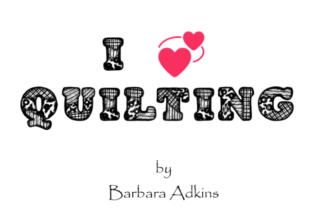

# Hello and welcome!

This project is about something near and dear to my heart…quilting. When I was younger my mother would make the most beautiful quilts. While they were in the quilting frame (to allow for hand stitching of the quilt), I would sit underneath and as the light filtered through I would imagine that it was stained glass. I picked up my mother’s love of quilting (and other crafting projects) and at a young age, about 6 or so, I made my first quilt, just the right size for a doll. I have learned other crafts over the years: knitting, crocheting, latch hook, cross stitch. I always return to sewing/quilting eventually.

**I have broken the project into 5 sections**:

- **Home**: a welcome and thank you for visiting
- **Information**: This is a page for tips/tricks for quilting and other crafts.
- **Resources**: This page has the map and the inch/centimeter converter.
- **Patterns**: just a few of my favorites with links to Fat Quarter Quilts where you can browse their site and maybe find your own favorites.
- **Contact**: A way for visitors to start a conversation with me about any questions/topics.

## Requirements met:

1. Retrieve data from a third-party API and use it to display something within your app.
2. Convert user input between two formats and display the result. (e.g. Fahrenheit to Celcius, kilograms to pounds, etc)
3. Use arrays, objects, sets or maps to store and retrieve information that is displayed in your app.

## Capstone Features:

**API: Foxes**

The API that I used was the product of trial and error. Various tutorials were used as well as feedback from fellow students and mentors. It is on the Information page to provide a break for a crafter when things don’t go well.

**Map: Google Maps:**

Google provided the code for this aspect of the project. I felt it was a good addition as I travel looking for crafting stores and a good map resource is essential. It defaults to Joann’s Fabric and Crafts as that supply store is a favorite of mine

**inches/Centimeter Converter:**

Many times I have gotten a pattern from someone and it would be in cm and I would have to convert it to inches before I could use it. Also, outside the US, the metric system is used so the dimensions of cloth pieces may be deceptive.

**Email contact form:**

A way for fellow crafters to share ideas with the site or ask questions of me.

## To run this project you will need VS Code and Git.

**How to run this project:**

- Go to github.com/Barleead/Quilting and clone or fork the repository.

- Open Git – If you need to install Git, the steps can be found here: Git Guides - install git · GitHub

- Enter the following commands to create a virtual environment inside git:

  Windows:

      1. python -m venv venv
      2. source venv\Scripts\activate
      3. pip install -r requirements.

  Linux/Mac0S:

      1. python3 -m venv venv
      2. source venv/bin/activate
      3. pip install -r requirements.txt

- After the virtual environment is created, type “git clone” followed by the URL you copied when cloning the repository.

- Open VS code and navigate to File > Open Folder. Then navigate to the location where the repository was copied. Highlight the “Quilting” folder and click select folder.
- If you already have the Live Server extension then you can right click on any .html file and choose “Open with Live Server”. If you do not have the extension, you can add it by selecting the extensions icon (on the left) and searching for Live Server.

- To exit the virtual environment type “deactivate” in the git/terminal window.

Note: The QR codes on the Patterns page may not be scannable as the trial may have expired. However, they will still work as buttons. Also, I have items in the img folder that are not yet included in the project. I am wanting to use them later.

The key for line 17 on Contact.html is missing. It will need to be added before sending an email. To get the code, please message me on slack if needed.

**Acknowledgements:**

I would like to thank my mentors, Blake Herbert and Michael Puckett for the encouragement/motivation and syntax/coding suggestions.

Chris Metcalfe, Jodie Mullins. Sebastian Frohm, Ivy Ownn and Ken Quiggens answered questions, shared ideas and made recommendations on when and where I should alter my code.

I used a few websites to also get help with definitions, syntax and steps: Google, Pluralsight, Scrimba, Free Code Camp and MDN. There were others that I used to find information, but these are the ones I used the most.

I used ChatGPT when I knew my syntax was off and couldn't find the issue, for "why isn't this working? questions.

A huge “Thank you” to the Fat Quarter Shop, for permission to use the patterns and pictures from their site.
